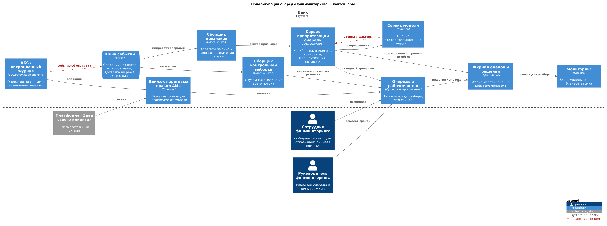
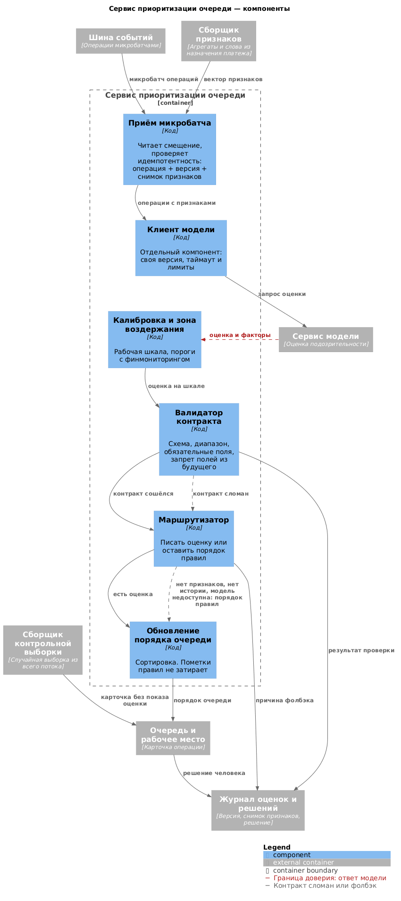

# Архитектура сервиса — выявление подозрительных операций (флагман)

Сервис не выносит вердикт «схема или не схема» и не вмешивается в проведение платежа. Всё, что он делает, — меняет порядок очереди, которую финмониторинг разбирает и сегодня. Пороговые правила продолжают помечать операции так же, как помечали до него, а решение эскалировать операцию, отказать в проведении или снять пометку по-прежнему принимает сотрудник.

Из этого ограничения вырастает вся остальная архитектура, поэтому дальше оно повторяется в каждом разделе: там, где обычно стоит вопрос «можно ли доверить это автоматике», у нас ответ уже дан заранее.

---

## Границы: что считает модель, что — код, что — человек

Поток операций раскладывается по шагам, и на каждом нужно понять, требуется ли здесь закономерность, которую можно вывести только из примеров, или ответ считается по заданным правилам.

| Шаг | Кто делает | Почему так | Цена ошибки |
|---|---|---|---|
| Принять операцию из потока | Обычный код | Операция уже есть в банке, выучивать нечего | Потерянная операция не попадёт ни в правила, ни в очередь |
| Пометить операцию пороговыми правилами и сигналом KYC | Обычный код | Признаки явные, а сама процедура внутреннего контроля обязательна по AML | Пропущена схема, которую правило умеет ловить, либо лишняя пометка на честном клиенте |
| Собрать признаки: сумму, контрагента, ОКВЭД, канал, агрегаты за окно, слова из назначения платежа | Обычный код | Всё считается по формуле и справочнику | На устаревших или неполных признаках порядок очереди получится случайным |
| Оценить подозрительность операции | Модель | Сочетание признаков, по которому схема отличается от обычной оплаты, правилом не выписать | Схема опускается вниз очереди и не разбирается вовремя, либо наоборот — честная операция занимает место, которого не хватает настоящей |
| Проверить ответ модели по контракту | Обычный код | Форму ответа гарантировать можно, а смысл — нет | Испорченный ответ попадёт в очередь как полноценная оценка |
| Переставить очередь, не трогая пометки правил | Обычный код | Сортировка полностью определяется числами | Модель затрёт обязательную пометку AML |
| Отобрать контрольную выборку из всего потока | Обычный код, разметка — человек | Иначе качество меряется только на том, что отобрали правила | Смещение отбора, которое мы создадим себе сами |
| Разобрать операцию, эскалировать, отказать, снять пометку | Человек | Это обязанность банка по AML, и ошибка дорога с обеих сторон | Предписание надзора либо жалоба и уход клиента |

Из восьми шагов модель нужна ровно в одном. Дополнять её контекст документами, давать инструменты или отдавать маршрут агенту здесь незачем: последовательность шагов известна заранее, справочники и агрегаты считает обычный код, а обращаться к внешним системам за актуальными данными модели не приходится — всё, что ей нужно, приходит готовым вектором признаков.

---

## Режим обработки

Операции приходят к сервису не напрямую из АБС, а через шину событий, и именно она задаёт режим. Читать шину по одной записи невыгодно: накладные расходы на обращение оказываются больше самого расчёта. Поэтому потребитель забирает записи **микробатчами** — десятки и сотни операций за проход, — и модель считает их одним вызовом, а не строкой за строкой. Так устроены все шины этого класса, Kafka здесь типичный пример.

Отсюда и пакетность в нашем сервисе, но пакет здесь не означает ночной прогон. От появления операции в шине до обновления приоритета проходят секунды. Держать операцию сутки невыгодно никому: за это время деньги по транзитной цепочке уйдут, а агрегаты за короткое окно, по которым видно дробление под пороги, окажутся несвежими ровно там, где они нужнее всего.

Платёж при этом сервиса не ждёт. Он проводится своим путём, правила помечают его в моменте, как и сегодня, а мы стоим сбоку и меняем только порядок очереди на разбор. Поэтому секунда задержки ни на что не влияет, а сотрудник всё равно берёт следующую операцию из списка, а не ждёт ответа на экране.

Шина доставляет сообщение как минимум один раз, так что повторы — штатное событие, а не сбой. Если потребитель упал и перечитал смещение заново, в очереди не должна появиться вторая карточка, а одна операция не должна получить две расходящиеся оценки. Поэтому у каждого расчёта есть ключ идемпотентности: идентификатор операции вместе с версией модели и снимком признаков. Повтор берёт тот же ключ и дописывает только недостающее.

Настоящий пакетный прогон в архитектуре тоже есть, но занят он другим — пересчитывает тяжёлые агрегаты за длинные окна и заново прогоняет историю после смены версии модели. В оперативном пути он не участвует.

Синхронный вызов остаётся ровно в одном месте — на рабочем месте сотрудника, который открыл конкретную операцию и хочет видеть её текущую оценку и факторы. Обычно этот вызов просто читает уже посчитанный результат. Если результата ещё нет, сервис считает одну операцию с таймаутом и индикатором ожидания, и такой пересчёт не создаёт в очереди второй записи.

---

## C4. Контейнеры

Исходник: [`diagrams/c4_1_container.puml`](diagrams/c4_1_container.puml)

Красным пунктиром отмечены две границы доверия — те самые линии, по которым дальше расставлены угрозы.

Первая проходит там, где в систему попадает операция вместе с назначением платежа. Это свободный текст, и его содержимым управляет отправитель, а не банк. Вторая — там, где ответ модели возвращается в систему: всё, что стоит дальше по цепочке, оценке и факторам на слово не верит, поэтому они идут не прямо в очередь, а через валидатор.

Внешняя платформа «Знай своего клиента» даёт правилам вспомогательный сигнал, но окончательную оценку клиенту банк выносит сам.

Стоит обратить внимание и на то, чего на схеме нет: от модели не идёт ни одной стрелки к отказу в платеже. Между её оценкой и любым действием, которое почувствует клиент, всегда стоят валидатор, правила и человек.

---

## C4. Компоненты сервиса приоритизации

Ниже раскрыт один контейнер — сервис приоритизации очереди. Сборщик признаков, сервис модели, сборщик контрольной выборки, очередь и журнал остаются соседними контейнерами и показаны серым.

Исходник: [`diagrams/c4_1_component.puml`](diagrams/c4_1_component.puml)

| Компонент | Что делает | Модель, код или человек |
|---|---|---|
| Приём микробатча | Читает записи из шины с текущего смещения вместе с готовым вектором признаков и проверяет идемпотентность | Код |
| Клиент модели | Обращается к сервису модели. Вынесен отдельно, а не спрятан внутри обработчика, потому что у него своя версия, свой таймаут и свои лимиты | Код |
| Калибровка и зона воздержания | Переводит сырую оценку в рабочую шкалу и отмечает случаи около середины шкалы, где уверенности на самом деле нет | Код, пороги согласованы с финмониторингом |
| Валидатор контракта | Проверяет схему, обязательные поля, диапазон оценки и отсутствие полей, которых у новой операции быть не может | Код |
| Маршрутизатор | Решает, пойдёт ли оценка в очередь или порядок останется прежним, по правилам | Код |
| Обновление порядка очереди | Пересортировывает очередь, не трогая пометки правил | Код |

Соседние контейнеры на той же схеме:

| Контейнер | Что делает | Модель, код или человек |
|---|---|---|
| Шина событий | Доставляет операции из АБС и отдаёт их потребителям микробатчами, не реже одного раза каждую | Инфраструктура |
| Сборщик признаков | Считает агрегаты, подтягивает справочники и разбирает назначение платежа на слова. Исход расследования и отметку эксперта не использует: у новой операции этих полей ещё не существует | Код |
| Сервис модели | Считает оценку подозрительности | Модель |
| Сборщик контрольной выборки | Отбирает случайную и стратифицированную выборку из всего потока, а не из очереди | Код |
| Очередь и рабочее место | Показывает оценку, факторы, пометку правила и причину, по которой операция здесь. Решение принимает сотрудник | Человек |
| Журнал оценок и решений | Хранит версию модели, снимок признаков, оценку и решение человека | Код |

---

## Выходной контракт

Модель возвращает число для сортировки, а не вердикт, и между этим числом и изменением очереди стоит валидатор.

| Поле | Обязательно | Откуда | Как проверяем | Что если не сошлось |
|---|---|---|---|---|
| Идентификатор операции | Да | АБС | Такая операция есть в потоке, формат совпадает | Микробатч в очередь не пишем, поднимаем алерт |
| Оценка подозрительности | Да, если не сработал фолбэк | Модель | Число в диапазоне от 0 до 1 | Оставляем порядок правил, причину пишем в журнал |
| Версия модели | Да | Конфигурация сервиса | Не пустая и есть в реестре версий | Ответ не принимаем и действуем так, как будто модели не было |
| Идентификатор снимка признаков | Да | Сборщик признаков | Присутствует и не старше согласованного окна | Считаем признаки устаревшими и уходим в фолбэк |
| Топ-факторы | Да, если есть оценка | Модель | Список не пустой, имена взяты из известного набора признаков | Оценку показываем без объяснения и поднимаем случай на разбор |
| Признак фолбэка и его причина | Да | Маршрутизатор | Причина из закрытого списка | Пишем «неизвестно» и поднимаем алерт на сервис |
| Время расчёта | Да | Сервис | Не из будущего и не старше согласованного отставания от шины | Пересчитываем |

Пустая оценка — нормальный ответ, если сработал фолбэк. А вот оценка, посчитанная на пустых признаках, недопустима, и следит за этим маршрутизатор: когда признаков нет или у клиента нет истории, поле остаётся пустым.

Ссылки на источник в привычном смысле здесь не появится, потому что сервис ничего не извлекает из документа и цитировать ему нечего. Её роль делят два поля — идентификатор снимка признаков и топ-факторы. По ним сотрудник видит, на каких числах построена оценка, а при разборе через месяц можно поднять ровно ту же картину.

Кроме схемы, до обновления очереди выполняются проверки, которые целиком считает обычный код:

- в признаках нет исхода расследования и отметки эксперта, то есть полей, которых на момент операции не существовало;
- сумма, дата и канал совпадают с тем, что пришло из АБС;
- оценка лежит в допустимом диапазоне;
- версия модели закреплена и записана вместе с результатом.

Если хотя бы одна проверка не прошла, порядок очереди для этой операции не меняется: остаётся то, что дали правила и текущая сортировка по сумме.

---

## Уровень автоматизации

Уровень автоматизации принято выбирать не для сервиса целиком, а для класса случаев. Мы так и сделали, но все классы здесь сошлись в одной точке: система только рекомендует порядок. Ни автоматического отказа, ни автоматической блокировки, ни автоматического «операция чистая» в сервисе нет.

| Класс случая | Что делает система | Кто решает по кейсу | Кто принимает риск режима |
|---|---|---|---|
| Высокая оценка, правило тоже сработало | Поднимает операцию в очереди и показывает карточку с факторами и пометкой правила | Сотрудник финмониторинга | Руководитель финмониторинга |
| Высокая оценка, правило молчит | Поднимает операцию с отметкой, что её выделила модель. Такие случаи разбираем внимательнее: это либо новая схема, либо ложная тревога | Сотрудник финмониторинга | Руководитель финмониторинга |
| Оценка в зоне воздержания | Не делает вид, что уверена, и оставляет операцию в обычном порядке правил | Сотрудник, если операцию пометило правило или она попала в контрольную выборку | Руководитель финмониторинга |
| Новый клиент или сегмент без истории | Оценку не пишет, порядок определяют правила | Сотрудник финмониторинга | Руководитель финмониторинга |
| Крупная сумма | Правила и так дают приоритет. Модель может поднять операцию выше, но не может опустить её ниже | Сотрудник финмониторинга | Руководитель финмониторинга |

Отдельно стоит объяснить, почему автоматического пути нет даже для мелких и на вид чистых операций, хотя именно там его обычно и открывают. Контроль в AML строится на признаках операции, а не на её сумме, и мелкий платёж вполне может оказаться частью дробления. Стоит появиться порогу, ниже которого операции проходят автоматически, как он немедленно становится инструкцией, по которой крупную сумму разбивают на несколько мелких.

Человек в этом процессе уже сидит, и мы не ставим рядом отдельную комиссию, которая будет «смотреть на ИИ». Сервис встраивается в существующую очередь и существующее рабочее место. Карточка операции отвечает сотруднику на три вопроса: почему операция здесь (сработало правило, подняла модель или это контрольная выборка), какие факторы дали оценку и чего система не утверждает — она не предлагает ни отказать, ни заблокировать, ни признать операцию схемой. Набор действий остаётся прежним: разобрать, эскалировать, отказать в проведении, снять пометку, зафиксировать причину.

С подсказкой всегда легче согласиться, чем перепроверить её, и чем лучше работает модель, тем сильнее этот эффект. Против него у нас два недорогих средства. Операции из контрольной выборки сотрудник размечает вслепую: оценка на карточке скрыта. А на крупных суммах отдельно смотрим время разбора, потому что слишком быстрое решение при высокой ставке — это сигнал, а не экономия.

Исправления сотрудника мы пишем в журнал, но в обучающую выборку их не кладём. Чтобы они стали разметкой, нужны единый гайдлайн, известное происхождение метки и разбор спорных случаев. Без этого обратная связь закрепит не закономерность, а привычки конкретных людей.

---

## Fallback

Случай уходит с обычного пути по двум совершенно разным причинам, и путать их нельзя. В первом случае ответ модели есть, но доверять ему не стоит. Во втором ответа нет вовсе.

### Когда ответу нельзя доверять

В этом сервисе эскалация выглядит не так, как в постановках, где модель что-то решает сама. Операция и так дойдёт до человека — вопрос лишь в том, участвует ли оценка в её приоритете. Если ответ сомнителен, оценку просто не используем.

Решаем это по признакам, которые проверяются со стороны, а не по тому, насколько уверенной себя объявила модель:

- нужных признаков нет или они старше согласованного окна;
- значение выходит за границы того, что модель видела на обучении;
- у клиента или у целого сегмента нет истории;
- оценка попала в зону воздержания около середины шкалы;
- правило сработало, а модель поставила очень низкую оценку, или наоборот;
- назначение платежа пустое, обрезанное или состоит из набора символов, по которым признаки не считаются.

В любом из этих случаев очередь для операции строится так же, как строилась раньше, — по правилам и сумме. Причину сотрудник видит в карточке, а сервис считает такие случаи отдельно и отдаёт их число в мониторинг.

### Когда ответа нет

Сюда относятся отказы доступности: сервис модели не отвечает или не укладывается в таймаут микробатча, сборщик признаков недоступен, расчёт перестаёт успевать за потоком и отстаёт от шины.

Сначала сервис перечитывает записи с того же смещения — дубли здесь безопасны благодаря ключу идемпотентности. Если модель так и не ответила, очередь остаётся в порядке правил — это ровно тот процесс, который работает сегодня. Если недоступен и сборщик признаков, сервис переходит в ограниченный режим: операции принимаются, но очередь не пересчитывается, и руководитель финмониторинга получает об этом сигнал.

Важно, что это не эскалация. Человек не получает никакой дополнительной работы, очередь просто живёт по правилам, как жила до появления сервиса.

---

## Очередь: владелец и срок

Очередь легко нарисовать на схеме, но вместе с ней появляется вопрос, который обычно откладывают: кто конкретно возьмёт эту работу и что произойдёт, если её не возьмут вовремя.

| Компонент или очередь | Владелец | Допустимое ожидание | Что при превышении | Кто получает сигнал |
|---|---|---|---|---|
| Микробатч операций из шины | Владелец сервиса | Секунды, отставание от шины не больше согласованного | Перечитать с того же смещения, при растущем отставании — ограниченный режим | Владелец сервиса |
| Очередь разбора финмониторинга | Руководитель финмониторинга | Как сейчас: разбор в пределах смены, крупные суммы раньше | Поднять крупные и помеченные правилами, разобраться, почему выросло число эскалаций | Руководитель финмониторинга |
| Контрольная выборка на разметку | Руководитель финмониторинга | Неделя на пачку | Новую пачку не набираем, пока не разобрана текущая, иначе качество меток поедет | Владелец сервиса и руководитель финмониторинга |
| Журнал | Владелец сервиса | Запись сразу | Без записи в журнал микробатч не считается обработанным | Владелец сервиса |

Очередь разбора у нас та же, что и сегодня, и в этом её главное достоинство: у неё уже есть владелец, есть глубина в 25 человек и около 10 тысяч разборов в месяц. Второй очереди «посмотреть на модель» рядом не появляется — именно такие очереди обычно остаются без владельца и превращаются в место, где работа теряется.

---

## Мониторинг

Смотреть только на качество модели недостаточно: сломаться может любое звено, а бизнес почувствует это раньше, чем сдвинется метрика. Поэтому наблюдение разложено по четырём слоям — вход, модель, очередь человека и бизнес-результат, — и у каждого сигнала есть порог, реакция и ответственный.

| Сигнал | Слой | Порог | Реакция | Ответственный |
|---|---|---|---|---|
| Отставание потребителя от шины | Вход | Выше согласованных секунд | Ограничить размер микробатча, добавить потребителей, при продолжении роста — ограниченный режим | Владелец сервиса |
| Доля операций с пустыми или устаревшими признаками | Вход | Рост относительно обычной недели | Проверить сборщик признаков и не считать оценку на неполных данных | Владелец сервиса |
| Появление сегмента, которого не было в обучении | Вход | Заметная доля потока | Не писать оценку по этому сегменту, пока по нему не размечена контрольная выборка | Владелец сервиса |
| Доля ответов, не прошедших контракт | Модель | Выше согласованного уровня | Прогнать проверочный набор и сверить версию модели | ML-команда |
| Доля фолбэков | Модель | Рост за неделю | Разобрать, сломался вход или модель | ML-команда |
| Сдвиг распределения оценок | Модель | Расхождение с картиной на контрольной выборке | Разобраться, изменился поток или последняя версия. Если версия — вернуть предыдущую | ML-команда |
| Длина очереди и время до разбора | Очередь человека | Выше обычного при той же пропускной способности | Вернуть сортировку по правилам и сумме, разобрать причину роста | Руководитель финмониторинга |
| Доля случаев, где сотрудник не согласился с предложенным приоритетом | Очередь человека | Рост | Причиной может быть и просадка модели, и изменение потока, и возросшая строгость сотрудников. Смотреть только вместе со следующей строкой | Руководитель финмониторинга и ML-команда |
| Ошибки, найденные после разбора: пометку сняли, а схема подтвердилась, или наоборот | Очередь человека | Рост | Разбор стал формальным, нужна проверка вторым сотрудником на дорогих классах | Руководитель финмониторинга |
| Доля действительно подозрительных среди разобранных top-N против текущего порядка | Бизнес | Не выше, чем у текущего порядка | Признать, что ранжирование не даёт прироста, и вернуться к правилам | Владелец продукта |
| Ложные приостановки и жалобы клиентов | Бизнес | Рост против текущего уровня | Откатить порядок очереди к правилам и разобрать случаи | Владелец продукта и руководитель финмониторинга |

Две первые метрики очереди расходятся между собой, и в этом их польза. Когда подтверждения становятся формальными, доля несогласий падает, а доля ошибок, найденных позже, растёт. Когда просела сама модель, растут обе. По одной из них картина получится обратной действительности.

Чтобы эти цифры не зависели от решения самого сотрудника, нужна выборка с независимо известным ответом, и таких выборок две. Случайная из всего потока даёт несмещённую оценку положения дел. Стратифицированная по сегментам и суммам целится в редкие дорогие случаи, которых в случайной выборке почти не встретится. Объём считаем по фактическому потоку и по тому, как быстро нужно замечать просадку, а не назначаем условные пять процентов заранее.

Результат разбираем по сегментам — по типу клиента, сумме, каналу, наличию истории. Средняя цифра легко спрячет просадку на отдельном сегменте: выигрыш на одних клиентах перекроет потерю на других, и заметить это удастся только тогда, когда схема уже пройдёт мимо.

Новая версия модели сначала работает в теневом режиме: считает параллельно с текущей, но в очередь не пишет. Сама версия задаётся конфигурацией, а не константой в коде, поэтому откат не требует выката новой сборки.

---

## Угрозы на границах доверия

Каждая угроза ниже привязана к конкретной линии на схеме контейнеров, а не собрана в общий список предостережений про ИИ.

**Назначение платежа приходит от клиента.** В этом поле отправитель пишет что угодно, и оно попадает в расчёт признаков. Для нашей постановки это не промпт к языковой модели, а текст, из которого код достаёт слова, поэтому и вред здесь другой: мусор вместо содержания, формулировки, подогнанные под дробление, попытка наполнить поле редкими словами и сдвинуть признак. Поэтому текст обрезается и нормализуется до расчёта признаков, а не кладётся в модель как есть. Модель при этом не вызывает никаких инструментов и ничего не пишет в АБС. Если текста нет или он не разбирается, сервис уходит в фолбэк вместо того, чтобы выдать уверенную оценку.

**Ответ модели возвращается в систему.** Оценку и факторы нельзя подставлять ни в запрос к базе, ни в шаблон письма клиенту, ни в команду блокировки: для всего, что стоит дальше, это такие же данные извне, и они проходят проверку схемы, типов и диапазона. Права здесь урезаны до предела. Модель не может ничего провести, отказать или пометить клиента, а единственное действие после валидного ответа — изменить число в поле приоритета очереди. По тому же принципу выданы и служебные доступы: сборщик признаков читает АБС и справочники, но не может в них писать, а сервис приоритизации пишет только поле приоритета и записи журнала и не имеет доступа ни к платёжным реквизитам, ни к полям пометок AML. Доступ, выданный на всякий случай, рано или поздно будет использован не так, как задумано.

**Признаки и веса приходят из нашей же цепочки поставки.** Если в признаки просочится поле из будущего или подменятся веса модели, очередь начнёт врать не в одной операции, а системно, и заметить это по отдельным случаям не получится. Поэтому запрещённые поля отсекаются кодом сборщика, а не договорённостью с командой, версия весов и зависимостей фиксируется вместе с источником, а дообучение на потоке разбора без гайдлайна мы не включаем: иначе в следующую версию модели попадут привычки смены и смещение очереди.

**Данные не должны покинуть контур.** На пилоте модель работает в нашем контуре, и в запрос к ней уходит не досье клиента, а признаки операции и агрегаты. Журнал хранит идентификатор операции, версии, оценку, короткие имена факторов и действие человека — но не выписку по счёту. Срок хранения и состав доступа согласуем с DPO, потому что журнал нужен, чтобы через месяц объяснить решение, а не чтобы завести второй операционный архив.

**Нагрузка.** Плата за вызов и лимиты провайдера нам не грозят: модель своя. Риск другой — отставание от шины. Если расчёт перестаёт успевать за потоком, отставание копится незаметно: сервис формально работает, а очередь показывает вчерашнюю картину. Поэтому размер микробатча ограничен сверху, а само отставание вынесено в мониторинг отдельным сигналом с порогом.

---

## Роли

Схема с проверками ничего не стоит, если у них нет владельцев: в момент инцидента выясняется, что решение принимать некому.

| Вопрос | Кто отвечает |
|---|---|
| Кто утверждает, что модель только меняет порядок очереди и не блокирует операции | Руководитель финмониторинга |
| Кто получает алерты по метрикам сервиса и разбирает их | Владелец сервиса и ML-команда |
| Кто может выключить ранжирование и вернуть порядок правил | Дежурный и владелец сервиса, без согласований |
| Кто разбирает инцидент | Владелец сервиса вместе с финмониторингом, а при утечке данных — со службой информационной безопасности |
| Как клиент оспаривает приостановку | Тем же порядком, что и сейчас, с разбором человеком. Отдельного канала из-за модели не появляется, потому что модель платежи не останавливает |
| Когда сервис выводим из эксплуатации | Владелец продукта — если precision@N не превышает текущий порядок при той же нагрузке на разбор |

Отдельно стоит оговорить право на выключение. Перевести сервис в режим, где очередь снова строится по правилам, нужно уметь за минуты и без выката новой версии. Раз ранжирование задаётся конфигурацией, такая возможность есть по построению, и пользоваться ею дежурный может, ни с кем не согласовывая.
