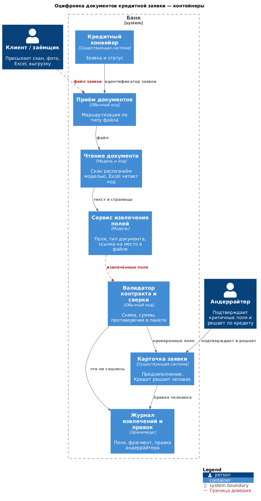

# Архитектура сервиса — оцифровка документов кредитной заявки (№ 2)

Сервис предзаполняет карточку заявки, чтобы андеррайтер не вводил данные руками. Решение по кредиту остаётся за ним, а критичные поля попадают в карточку только после его подтверждения.

Ниже — уровень контейнеров. Раскрывать компоненты, как у флагмана, здесь не требуется.

---

## Границы

| Шаг | Кто делает | Почему так |
|---|---|---|
| Принять файл и определить его тип | Обычный код | Признак явный, выучивать нечего |
| Прочитать Excel и структурированную выгрузку | Обычный код | Поля уже разложены по таблице |
| Прочитать скан и фото | Модель распознавания | Это изображение, правилом его не прочитать |
| Извлечь поля и определить вид документа | Текстовая модель | Смысл и раскладка страницы правилом не выписываются |
| Сверить суммы, даты и имена внутри документа и между документами | Обычный код | Обычное сравнение значений |
| Подтвердить критичные поля и принять решение по кредиту | Андеррайтер | Ошибка здесь оборачивается неверным решением по сделке |

Маршрут обработки известен заранее: файл принимается, читается, из него извлекаются поля, они проверяются и показываются человеку. Агент в такой последовательности не нужен, а справочники и сверки выполняет код, не модель.

Режим обработки **асинхронный**. Пакет документов по заявке обрабатывается после загрузки, и андеррайтер не ждёт ответа на каждый файл. Синхронно он может только перечитать уже готовый результат по открытой заявке.

---

## C4. Контейнеры

Исходник: [`diagrams/c4_2_container.puml`](diagrams/c4_2_container.puml)

Границ доверия тоже две. Первая — документ, который прислал клиент: его содержимым распоряжается отправитель, и в скане может оказаться что угодно, не только баланс. Вторая — извлечённые поля на входе в карточку заявки: до валидатора доверять им нельзя, а критичные поля не попадают в карточку и после него, пока их не подтвердит человек.

Прямой стрелки от модели к решению по кредиту на схеме нет.

---

## Выходной контракт и участие человека

Модель возвращает набор полей, для каждого — ссылку на место в документе, уверенность и вид документа. Пустое поле считается нормальным ответом, если значения в документе действительно нет. Правдоподобная выдумка вместо пустого значения — нет.

Прежде чем поле попадёт в карточку, код проверяет, что схема ответа сошлась, что у каждого заполненного поля есть ссылка на фрагмент документа, что суммы внутри документа бьются между собой и что документы пакета не противоречат друг другу по ключевым значениям. Если проверка не прошла, поле не заполняется автоматически, а андеррайтер видит пометку о том, что именно не сошлось.

Уровень автоматизации различается по классам полей. Некритичные поля с высокой уверенностью и сошедшейся сверкой предзаполняются, и андеррайтер может их поправить. Критичные поля всегда идут на подтверждение, насколько бы уверена ни была модель. Решение по кредиту принимает только человек.

Очередь заявок на проверку принадлежит руководителю андеррайтинга. Это та же очередь заявок, что и сейчас, а не отдельный «разбор ИИ» сбоку от процесса.

---

## Fallback, мониторинг, угрозы

К человеку случай уходит, когда ответ не прошёл схему, когда у поля нет ссылки на источник, когда документы пакета противоречат друг другу, когда скан слишком плохого качества или когда попался незнакомый вид документа.

Отказ доступности разводим с этим отдельно. Если распознавание или модель недоступны, заявка обрабатывается как сегодня, с ручным вводом. Повтор идёт по ключу из идентификатора заявки, файла и версии модели, поэтому второй карточки не появляется.

В мониторинге смотрим долю сканов плохого качества на входе, долю ответов, не прошедших контракт, долю полей, которые андеррайтер правит руками, и время разбора заявки против нынешних полутора часов. Отдельно контролируем, что ни одно критичное поле не прошло в карточку без подтверждения.

Угрозы привязаны к тем же двум границам. В документе клиента может оказаться текст, рассчитанный на языковую модель, поэтому модель не получает инструментов и ничего не пишет в конвейер сама, а её результат режет валидатор. Извлечённые значения не подставляются в запрос к базе и не уходят клиенту в письмо как установленный факт. Сканы с персональными данными и банковской тайной на пилоте не покидают наш контур. Журнал хранит идентификатор заявки, извлечённые поля, ссылку на фрагмент и правку человека, но не сам скан бессрочно.
