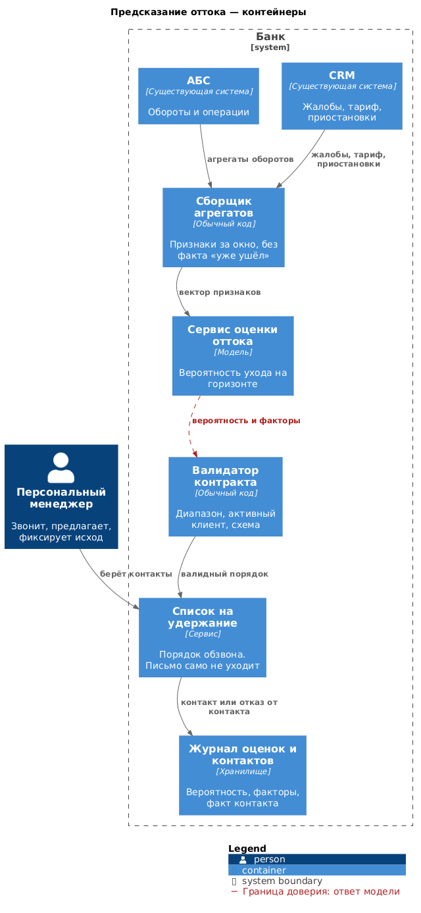

# Архитектура сервиса — предсказание оттока (№ 8)

Сервис раз в период пересчитывает вероятность ухода по активным клиентам и отдаёт персональным менеджерам список тех, кому стоит позвонить раньше остальных. Звонок, предложение и любые другие действия с клиентом остаются за человеком.

Ниже — уровень контейнеров.

---

## Границы

| Шаг | Кто делает | Почему так |
|---|---|---|
| Собрать агрегаты за окно: обороты, жалобы, приостановки, тариф | Обычный код | Счётчики и справочники |
| Оценить вероятность ухода | Модель | Закономерность в поведении клиента правилом не выписать |
| Отсортировать список под бюджет обзвона | Обычный код | Обычная сортировка по вероятности, отдельная модель ранжирования не нужна |
| Позвонить, предложить условия, зафиксировать исход | Персональный менеджер | Лишний контакт способен сам подтолкнуть клиента к уходу |

Дополнять контекст модели документами, давать ей инструменты или отдавать маршрут агенту здесь не нужно: свободного текста на входе нет, а последовательность шагов известна заранее — агрегаты, оценка, список, человек.

Режим **пакетный**: пересчёт идёт раз в неделю или раз в месяц по всем активным клиентам. Синхронный ответ никому не нужен, потому что менеджер работает со списком, а не с карточкой в момент платежа.

---

## C4. Контейнеры

Исходник: [`diagrams/c4_8_container.puml`](diagrams/c4_8_container.puml)

Существенная граница доверия здесь одна — ответ модели на входе в список обзвона. Вероятности и факторам система на слово не верит: сами по себе они не проставляют клиенту статус в CRM и не запускают рассылку. После валидатора меняется только порядок списка.

Данные на пилоте не покидают наш контур: агрегаты по оборотам — это банковская тайна.

---

## Выходной контракт и участие человека

Модель возвращает вероятность ухода на согласованном горизонте, версию, факторы и дату расчёта. Валидатор проверяет, что вероятность лежит в допустимом диапазоне, что клиент действительно числится активным и что в признаки не попал факт ухода, которого на момент расчёта ещё не было. Если проверка не прошла, клиент в список по модели не попадает.

Уровень автоматизации один для всех классов: система только рекомендует порядок обзвона. Автоматического письма, автоматической скидки и автоматических ограничений нет. Ложный контакт обходится дороже, чем кажется на первый взгляд, — лояльного клиента таким звонком можно как раз вытолкнуть.

Менеджер видит, почему клиент попал в список, какие факторы на это повлияли и каким бюджетом контактов он располагает на неделю. Действия остаются те же, что и в CRM: позвонить, предложить условия, отказаться от контакта, зафиксировать причину.

---

## Fallback, мониторинг, угрозы

Оценку не используем, когда у клиента нет истории, когда он относится к сегменту, которого не было в обучении, когда признаки устарели или когда вероятность попала в зону, где модель обычно ошибается на лояльных. Таких клиентов по модели не обзваниваем.

Если модель недоступна, списка на неделю просто нет, и менеджеры работают как сегодня — по поступившим жалобам. Это хуже, чем хороший список, но не хуже текущего процесса.

Очередь обзвона принадлежит руководителю сети персональных менеджеров, срок — неделя на пачку. Если пачку не разобрали, следующую не увеличиваем: иначе контакты станут формальными, а метрика удержания перестанет что-либо значить.

В мониторинге смотрим долю лояльных клиентов в top-k, долю тех, кому позвонили и кто всё равно ушёл, отток в контрольной группе, которой не звонили, и стоимость контакта против ценности удержанного клиента.

Угрозы те же по сути, что и у остальных сервисов. Оценка не должна сама запускать кампанию удержания. Журнал хранит идентификатор клиента, вероятность, факторы и факт контакта, а не выписку по счетам. Веса модели фиксируются вместе с источником, а в признаки не попадают поля, которых на момент расчёта не существовало.
