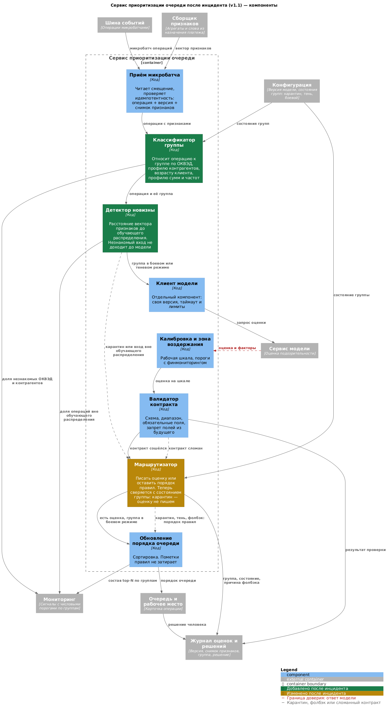

# Правка архитектуры после инцидента

---

## Почему механизм не сработал

Строка про этот сценарий в плане была. `Task3/architecture_1.md`:

### Корневая причина: класс «прочее»

Классификация клиентов в системе есть — по ОКВЭД, типу клиента, сумме, каналу. И как у всякой классификации по справочнику, у неё есть корзина «прочее», куда попадает всё, что справочник не опознал. Именно туда целиком ушёл новый сегмент.

Эта корзина ломает две вещи одновременно.

**В кодировании признаков она стирает новизну.** Незнакомый ОКВЭД не приходит в модель как пустое значение или ошибка — он приходит как валидная категория «прочее», которая в обучении встречалась и означала «мелкая редкая отрасль». Модель получает знакомый вход и не имеет ни малейшего повода усомниться в себе. Новизна исчезает раньше, чем её можно было бы заметить: к моменту вызова модели незнакомого в операции уже нет.

**В отчётности она создаёт иллюзию полного покрытия.** Каждая операция отнесена к какому-то классу, пропусков нет, разбивка по сегментам формально выполняется. Но класс, в который падает всё новое, — единственный, чья метрика бессмысленна по построению: он смешивает несвязанные вещи, его `precision@N` всегда был шумным, и порога на нём никто не держал. Даже если бы на него посмотрели, вывод «просело на прочем» ничего не подсказывает.

И третье упущение, более общее, чем сама корзина: **за распределением потока по классам не следили вовсе.** В плане есть сигналы на качество внутри классов, но нет ни одного на то, как меняются их доли в генеральной совокупности. Между тем сдвиг состава потока — самостоятельное событие, и наступает оно раньше любой просадки качества. Наблюдать его дёшево: разметка не нужна, нужны только доли, которые считаются по журналу. Если бы доля «прочего» отслеживалась как величина, расследование началось бы в первые же недели, а не через три месяца по факту просевшей бизнес-метрики.

Отсюда главное правило правки: **у класса «прочее» сигналом служит размер.** Качество мы измеряем по всем классам, включая этот, — но у «прочего» оно ничего не сообщает и порогом быть не может. Зато его доля в потоке сообщает, и это самый дешёвый признак появления нового сегмента: не требует ни детектора новизны, ни разметки, ни знания о том, что именно появилось. Рост «прочего» с обычных процентов до заметной доли — событие, на которое обязана быть реакция.

Второе правило — про поведение: **у сервиса должно быть определённое поведение на классе, которого он не знает,** по умолчанию, а не по решению человека, заметившего рост. Это и есть карантин. «Прочее» ограничено сверху по доле, и превышение переводит его в карантин целиком, без разбирательства, что за клиенты туда пришли.

### Что отсюда следует

**Признак должен нести отметку «значение не из обучающего справочника».** Это не то же самое, что значение «прочее». Модель и валидатор должны различать «редкая отрасль, которую мы видели» и «код, которого в обучении не было» — сейчас это одна и та же категория.

**Класс операции нужен в момент обработки, а не в отчёте.** Значит, компонент, который считает класс до вызова модели, и поле класса в контракте и журнале. Без этого реакция «не писать оценку по этому классу» неисполнима: адресовать её нечему.

**Перечень классов не может быть закрытым списком.** Тип клиента, сумма, канал, наличие истории — селлеры не выделяются ни одним из них, а ближайший разрез «наличие истории» пуст по построению, потому что клиентам без истории оценка не пишется вовсе. Список, который ведёт человек, не содержит того, о чём человек ещё не знает.

**Новизна клиента не равна новизне профиля.** Старый клиент банка, начавший торговать на площадке, прошёл бы мимо любого учёта новых клиентов: история есть, оценка пишется. Мерить надо расстояние вектора признаков до обучающего распределения, а не возраст клиента.

**Пороги должны быть числами.** «Заметная доля потока» не сравнивается ни с чем, поэтому не существует момента, в который дежурный обязан что-то сделать.

**Нужен опережающий сигнал.** Состав top-N меняется раньше, чем доля подтверждений. Между событиями — недели, в течение которых всё выглядит исправным.

### Почему сегментного `precision@N` всё равно было бы мало

Даже заработай разбивка по сегментам, полную картину она не покажет, и это стоит разобрать отдельно.

Когда селлеры заполняют top-N, их собственный `precision@N` действительно падает: среди них много ложных срабатываний. А вот у остальных сегментов он не падает, а может даже вырасти — в top-N из них пробиваются только самые сильные кандидаты.

Потеря у остальных состоит не в том, что разобранные операции оказались пустыми, а в том, что часть достойных разбора операций в top-N не попала вовсе. Это просадка `recall@N`, а не `precision@N`. Из чего следуют две правки, которых в плане не было:

- `recall@N` по сегментам выносится в мониторинг наравне с `precision@N`. Считается он только на контрольной выборке, потому что нужен знаменатель — сколько подозрительных было всего, а не сколько нашлось в top-N;
- состав top-N по группам становится отдельным сигналом. Он ловит вытеснение раньше обеих метрик качества и не требует разметки.

### Чего стоит считать по группам

У сегментного мониторинга есть цена, и о ней надо сказать прямо, иначе правка выглядит бесплатной.

`precision@N` и `recall@N` по группе считаются на контрольной выборке этой группы. Наша выборка — 300 операций в месяц на весь поток. При восьми группах это 37 операций на группу, при двадцати — пятнадцать, и такая оценка скачет от месяца к месяцу сильнее, чем сама просадка, которую мы ищем.

Отсюда два следствия. Разрезов должно быть немного, десяток крупных групп вместо детальной сетки. А объём слепой разметки придётся увеличить — это прямой рост строки «поддержание контрольной выборки» в смете.

---

## Что добавляем в мониторинг

Принцип: перестать опираться на имя сегмента и перейти к величинам, измеримым без него.

| Сигнал | Слой | Порог | Реакция | Ответственный |
|---|---|---|---|---|
| **Распределение потока по классам** | Вход | Доля любого класса изменилась больше чем на согласованную величину за неделю | Расследовать причину сдвига до того, как он отразится на качестве | Владелец сервиса |
| **Доля операций в классе «прочее»** | Вход | Вдвое выше базовой недели либо выше 5 % потока | Карантин для всего класса «прочее», затем разбор, что за клиенты туда пришли | Владелец сервиса |
| Доля операций со значением признака, которого не было в обучающем справочнике | Вход | 2 % потока за неделю | Разобрать и решить по карантину. Считается отдельно от «прочего»: редкая известная отрасль и незнакомый код — разные вещи | Владелец сервиса |
| Доля операций вне обучающего распределения | Вход | Процент потока за сутки, число фиксируется при обучении версии | Карантин для затронутых операций | Владелец сервиса |
| Доля операций без единого известного слова в назначении платежа | Вход | Рост против базовой недели в полтора раза | Проверить словарь, оценить долю сегмента без текстового сигнала | ML-команда |
| Состав top-N по группам | Очередь человека | Доля группы выросла вдвое за неделю | Проверить вытеснение. Опережающий сигнал, срабатывает до просадки бизнес-метрики | Владелец сервиса |
| `precision@N` по каждой группе | Бизнес | Просадка группы выше согласованной величины | Выключить ранжирование по группе | Владелец продукта |
| `recall@N` по каждой группе на контрольной выборке | Бизнес | Просадка группы выше согласованной величины | Проверить, не вытесняет ли группу кто-то другой | Владелец продукта |
| Медиана времени разбора и доля снятых пометок по группам | Очередь человека | Отклонение группы от общего уровня | Проверить, не стал ли разбор формальным | Руководитель финмониторинга |
| Доля фолбэков по группам | Модель | Выше половины операций группы | Перевести группу в карантин явно | ML-команда |

Два правила, которые фиксируем отдельно:

- **за составом потока следят отдельно от качества.** Сдвиг долей классов наступает раньше просадки метрик и наблюдается без разметки;
- **у класса «прочее» порогом служит размер, а не качество.** Качество считаем и по нему, но действовать по этой цифре нельзя: она смешивает несвязанные вещи;
- **следить можно только за тем, что существует в коде как объект.** Разрез, который аналитик считает по выгрузке, ни сигналом, ни реакцией стать не может;
- **у сигнала есть числовой порог, иначе это не сигнал.** Формулировки «заметный рост» и «выше обычного» в плане не остаются;
- **средняя метрика не является основанием ни для одного вывода** — ни для приёмки версии, ни для признания сервиса работающим.

---

## Группа как объект конфигурации

Без этого изменения правки в мониторинге некуда применять: сейчас ранжирование включено глобально, и реакций на инцидент ровно две — терпеть или выключить сервис для всех, включая сегменты, где он работает.

Группа определяется по наблюдаемым признакам: ОКВЭД, профиль контрагентов, возраст клиента, профиль сумм и частот. У каждой есть состояние.

| Состояние | Что происходит | Когда назначается |
|---|---|---|
| Карантин | Оценка не пишется, порядок за правилами. Операции копятся в кандидатах на разметку | По умолчанию для новой группы, а также по входному сигналу |
| Тень | Оценка считается и пишется в журнал, очередь не меняет | Контрольная выборка размечена, идёт набор наблюдений |
| Боевой | Оценка участвует в порядке очереди | Сегментный `precision@N` подтверждён на контрольной выборке группы |

Ключевое здесь — карантин по умолчанию. Новая группа не ранжируется не потому, что кто-то заметил её появление, а потому, что обратное требует действия. В разбираемом инциденте селлеры с первого дня шли бы по правилам, и вытеснения не произошло бы.

Состояние задаётся конфигурацией, как и версия модели, поэтому перевод в карантин не требует выката.

### Как это выглядит в сервисе

Зелёным отмечены новые компоненты, жёлтым — изменённый.

Исходник: [`diagrams/c4_1_component_v11.puml`](diagrams/c4_1_component_v11.puml). Предыдущая версия — [`Task3/diagrams/c4_1_component.puml`](../Task3/diagrams/c4_1_component.puml).

| Компонент | Что делает | Статус |
|---|---|---|
| Классификатор группы | Относит операцию к группе, читает состояния групп из конфигурации | Новый |
| Детектор новизны | Считает расстояние вектора признаков до обучающего распределения | Новый |
| Маршрутизатор | Добавилась сверка с состоянием группы: в карантине оценка не пишется независимо от ответа модели | Изменён |

Оба новых компонента стоят до клиента модели. Операция из группы в карантине не доходит до расчёта, а не получает оценку и отбрасывается на выходе.

---

## Регрессионный набор

Прогон обязателен при смене версии модели, набора признаков, справочника ОКВЭД, словаря назначения платежа, порогов калибровки и при появлении новой группы.

| Блок | Состав | Что проверяет |
|---|---|---|
| Приёмочная выборка | Замороженная контрольная выборка, стратифицированная по группам и суммам | `precision@N` и `recall@N` по каждой группе |
| Диагностический отсев | 12–20 операций из v0.2: транзит, обнал, дробление, редкая формулировка, клиент без истории, пропуски, противоречивые признаки | Поведение в конкретных ситуациях |
| Сегментные срезы | Минимальный набор на каждую известную группу | Что улучшение одной группы не куплено просадкой другой |
| Устойчивость входа | Пустое и обрезанное назначение, набор символов, отсутствующие признаки, устаревший снимок, незнакомый ОКВЭД | Что сервис уходит в фолбэк, а не оценивает мусор |
| Защитные ограничения | Обязательные пометки AML, крупные суммы, операции без истории | Что пометка не затёрта, крупная сумма не опущена, на операции без истории оценки нет |

Критерий приёмки: ни одна группа не просела больше согласованной величины. Рост среднего при просадке группы приёмкой не считается.

Правило пополнения: **группа, на которой случился инцидент, остаётся в наборе навсегда.** Селлеры входят с этого момента и не выходят, даже перестав быть новым сегментом. Набор растёт от инцидентов, а не от планирования.

---

## Выкатка и откат

Теневой режим и версия в конфигурации были с самого начала. Чего не хватало:

**Критерия выхода из тени.** Теперь версия выходит в боевой режим, когда по каждой группе накоплено достаточно наблюдений для сравнения с текущей. По группе в карантине — не раньше разметки её контрольной выборки.

**Выкатки по группам вместо доли трафика.** Пять процентов случайных операций размажутся по всем группам поровну и просадку на одной не покажут. Катим по группам, начиная с тех, где контрольная выборка есть.

**Автоматического стопа.** Выход сегментного `precision@N` или доли фолбэков за порог выключает ранжирование по группе без участия дежурного. Безопасно по построению: возврат к правилам клиент не замечает.

**Частичного отката.** Группа возвращается на правила отдельно, остальные продолжают работать с моделью. Полный откат остаётся крайней мерой и по-прежнему делается конфигурацией за минуты.

Не меняется: право выключить ранжирование у дежурного и владельца сервиса без согласований, откат без сборки, независимость обязательных пометок AML от всех этих переключателей.

---

## Сводка изменений

| Что было | Что стало | Зачем |
|---|---|---|
| Незнакомый код попадает в категорию «прочее» и выглядит для модели знакомым | Отдельная отметка «значение не из обучающего справочника» | Иначе новизна стирается до вызова модели |
| За распределением потока по классам не следят, только за качеством внутри них | Сдвиг долей классов — отдельный сигнал с порогом | Изменение состава потока наступает раньше просадки качества и видно без разметки |
| У «прочего» есть только метрика качества, а она шумная | Добавлен порог на **долю** «прочего» в потоке, превышение — карантин класса целиком | Качество смешанного класса действием не подкрепишь, его размер — подкрепишь |
| Класса нет в системе: сегмент считает аналитик по выгрузке | Класс определяется в коде до вызова модели, поле класса есть в контракте и журнале | Ни сигнал, ни реакция не могут адресоваться тому, чего в коде нет |
| Поведения на неизвестном классе не предусмотрено | Карантин по умолчанию | Реакция не должна зависеть от того, заметил ли кто-то появление класса |
| Сигнал «появление нового сегмента», порог «заметная доля потока» | Доля вне обучающего распределения, доля незнакомых ОКВЭД, покрытие словаря — с числовыми порогами | Обнаружение не требует знать имя сегмента |
| Список разрезов закрытый и ведётся руками | Группы выделяются по наблюдаемым признакам | Список, который ведёт человек, не содержит того, о чём он не знает |
| В таблице только `precision@N`, и только средний | `precision@N` и `recall@N` по группам | Вытеснение проявляется как просадка recall у остальных, precision его не видит |
| Опережающего сигнала нет | Состав top-N по группам с порогом на рост доли | Видно до просадки обеих метрик качества и без разметки |
| Ранжирование включено глобально | Состояние группы: карантин, тень, боевой | Выключение одной группы не трогает остальные |
| Новая группа сразу ранжируется | Карантин по умолчанию | Безопасное поведение не требует выбора |
| Тень без критерия выхода | Выход по накоплению наблюдений в каждой группе | Иначе тень кончается тогда, когда о ней вспомнят |
| Регрессионный набор: приёмочная выборка и диагностический отсев | Плюс сегментные срезы, устойчивость входа, защитные ограничения | Проверяем поведение, а не только среднее качество |
| Откат только целиком | Откат по группе | Просадка одной группы не стоит выключения сервиса для всех |
