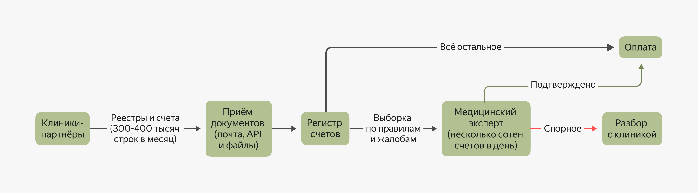
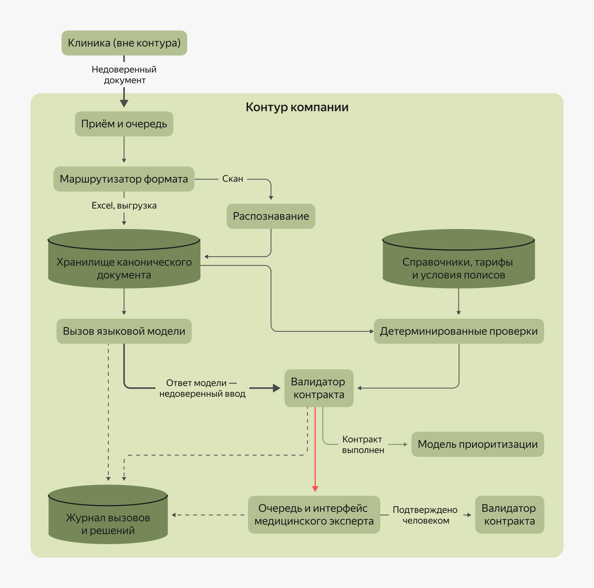

### Архитектура ИИ-сервиса: границы, конвейер и контракт

Согласование модели, контура и ADR закрывает только часть пути. Дальше поступает формулировка, которая на первый взгляд звучит как одна задача — встроить модель в процесс медицинской экспертизы. Однако за этой фразой скрывается десяток решений, и почти каждое из них потом трудно отменить.

Требуется определить, что из процесса выполняет модель, а что остаётся обычным кодом, и понять, отправляются ли к ней запросы синхронно или через очередь. Ответ модели может приходить за секунды, а в пиковый день растягиваться до минуты, и это различие нужно закладывать в конвейер заранее, а не устранять постфактум. Отдельного решения требует форма результата. Он должен поддаваться проверке ещё до того, как по нему пройдёт оплата. И где-то в этой цепочке должна появиться точка, в которой конкретный человек, опираясь на понятные основания, получает право на одобрение.

Всё это складывается в архитектуру ИИ-сервиса — то, как он делится на звенья и на каких условиях эти звенья договариваются между собой. Часть вам уже знакома — подход C4, принципы интеграции, очереди, идемпотентность, событийная модель. Новое начинается там, где в системе появляется вероятностный компонент, поведение которого нельзя заранее описать однозначным набором правил. Именно вокруг этой особенности выстраиваются границы сервиса, устройство конвейера обработки и контракт, который удерживает всё это вместе.

#### Постановка задачи

Итак, в инициативе ДМС-страховой задача была сформулирована так — встроить LLM в процесс медицинской экспертизы: разобрать входящие счета и реестры от клиник, извлечь из них структуру и приоритизировать проверку медицинскими экспертами.

К этому моменту известно, что в месяц поступает 300–400 тысяч строк услуг в разных форматах: таблицы Excel, выгрузки из медицинских информационных систем, сканы в PDF. Модель для извлечения структуры уже выбрана. Она компактна, управляема и работает в выделенном контуре. Распознавание документов вынесено в отдельный шаг конвейера — такое решение было принято ранее. Штат медицинских экспертов способен проверять не более нескольких сотен счетов в день, а решение о выплате затрагивает не только деньги компании, но и отношения с клиникой-партнёром.

На схеме представлено, как поток устроен без использования модели:


На схеме показан поток обработки счетов без использования модели. Документы от клиник поступают в реестр счетов. Большинство счетов сразу направляется на оплату, а выборка по правилам и жалобам — медицинскому эксперту. Подтверждённые счета оплачиваются, спорные передаются на разбор с клиникой.  

Узкое место видно сразу. Жирная стрелка на схеме — это счета, которые оплачиваются без проверки просто потому, что рук не хватает. Задача сервиса — не заменить медицинского эксперта, а изменить то, что попадает к нему на стол.

Руководитель ИИ-инициативы хочет запустить сервис через две недели и настаивает, что раз модель работает, к ней достаточно приделать очередь. У  специалиста в области архитектурных решений другая позиция: включать модель в процесс выплат преждевременно, пока не подтверждено, что она не выдумывает поля. Оба смотрят на разные концы одной схемы, которой пока нет.

За желанием встроить модель в процесс стоят четыре решения, и принимать их нужно в таком порядке:
1. Определить границ модели в сервисе.
2. Составить звенья ИИ-конвейера.
3. Установить режим его работы.
4. Зафиксировать выходной контракт.

#### Определение границ модели

Модель отвечает только за то звено, где присутствует настоящая неопределённость. Всё остальное выполняет обычный детерминированный код.

Поток счетов раскладывается по шагам. На каждом нужно определить, требуется ли закономерность, выучиваемая по примерам, или ответ вычисляется по заданным правилам.

|Шаг | Чем делается | Почему|
|---|---|---|
|Определить формат входящего файла | Обычный код | Признак явный, обучать нечего|
|Распознать скан | Специализированная модель распознавания | Другой класс задач, вынесен отдельно|
|Извлечь поля из свободного текста выписки | Языковая модель | Смысл в тексте, правилом не выписать|
|Сопоставить услугу со справочником тарифов | Обычный код | Детерминированный маппинг по коду|
|Сверить сумму с прайсом договора | Обычный код | Сравнение чисел|
|Найти дубль услуги в один день | Обычный код | Правило|
|Оценить, насколько счёт подозрителен | Отдельная модель приоритизации | Закономерность в истории, своя задача и метрики|
|Решить, платить ли по счёту | Человек | Деньги, отношения с партнёром, ответственность|

Из восьми шагов модель требуется в двух. И это разные модели с разными данными и метриками. Такое распределение служит прямым продолжением принципа, что модель машинного обучения живёт в конкретном звене, а не во всей инициативе.

Подобная таблица отвечает на вопрос, который иначе задаст архитектурный комитет: за что именно платят вероятностному компоненту и что произойдёт, если он ошибётся.? Пока границы не проведены, ответ звучит как «Модель разбирает счета». В такой формулировке она незаметно оказывается ответственной за выплату.

Модель по умолчанию знает только то, что было в её обучении, и не умеет ничего делать сверх этого. У неё нет доступа к справочнику тарифов, знания условий конкретного полиса и возможности что-то записать в систему. Чтобы модель могла участвовать в реальном процессе, а не только выдавать изолированный ответ, вокруг неё должны появиться звенья, которые дают ей нужные данные и забирают результат для дальнейшей обработки.

#### Сборка ИИ-конвейера

Получить контекст модели позволяют несколько способов. Часть данных кладётся прямо в контекст, а если заранее неизвестно, что именно понадобится, сначала выполняется поиск нужного (RAG). Модель получает доступ к данным и действиям через инструменты, которые вызывает сама, или право выбирать маршрут — тогда это уже агент, самостоятельно определяющий порядок шагов. Ещё один вариант — изменить саму модель через дообучение.

Эти способы комбинируются, и в реальном сервисе обычно работают два-три сразу.

##### 1. Дача нужных данных в контексте

Самый простой способ — передать модели вместе с запросом всё, что нужно для ответа: текст документа, фрагмент условий полиса, шаблон формата ответа. Такой подход работает, если нужный фрагмент известен заранее и помещается в окно контекста. Плата за него — токены на каждый вызов и ограничение размера окна: длинная выписка вместе со справочником в него может просто не поместиться.

##### 2. RAG

Когда нужный фрагмент заранее неизвестен и хранится где-то в большом наборе документов, его сначала требуется найти. Отсюда связка «поиск нужного фрагмента и подстановка его в контекст». Именно так работает RAG (retrieval-augmented generation) — способ дать модели актуальные знания без переобучения.

```
💡 RAG — не отдельная технология, а сборка из поиска и подачи контекста. Поэтому и качество складывается из двух составляющих: сначала из качества поиска, а затем — из качества ответа.
```

RAG работает там, где база знаний велика и продолжает меняться, а переобучать модель под каждое изменение бессмысленно. Цена такого подхода — качество поиска: если он подтянёт не тот пункт правил, модель уверенно ответит именно по нему, и такой ответ будет выглядеть ничуть не менее обоснованным, чем верный.

##### 3. Вызов функции

Модель может не знать ответ, а вызвать функцию: поднять историю пациента, проверить код услуги в справочнике, запросить статус договора. В этом случае данные приходят из системы, а не из памяти LMM. В документации провайдеров такой механизм обычно называется вызовом функций или инструментов.

Этот способ работает там, где нужны актуальные данные из систем или действие в них. Плата за него — сложность и права доступа: каждый инструмент — это возможность, которую модель способна применить не так, как задумано, и именно отсюда возникает правило минимальных прав. О нём ещё пойдёт речь в следующем уроке.

```
💡 Когда инструментов становится много, а обращаются к ним разные приложения, самописные интеграции быстро превращаются в разрозненный набор несовместимых решений. Отсюда появились протоколы подключения инструментов — единый способ описать, что инструмент умеет, какие у него параметры и права, как его обнаружить и версионировать. Важен сам факт наличия такого слоя, а не конкретная спецификация: стандарт означает, что инструменты переиспользуются между сервисами, а правами управляют централизованно, а не в каждом сервисе по отдельности.
```

##### 4. ИИ- агент


```
✏️  ИИ-агент — система на основе модели, которая сама планирует последовательность действий: на каждом шаге решает, какой инструмент вызвать или какие данные запросить дальше, опираясь на результат предыдущего шага, а не следуя заранее зафиксированному сценарию.
```

Как ИИ-агенты устроены, например, помощники разработчика. Они сами решают, какие файлы открыть, какие команды выполнить и как поправить код по результатам тестов.

Такой подход работает там, где маршрут шагов заранее неизвестен. Плата за него — предсказуемость, стоимость и сложность разбора: именно здесь чаще всего переплачивают.

##### 5. Дообучение

Дообучение применяется, когда контекст и инструменты не дают нужного качества, а задача устойчива и примеров для обучения достаточно.

Такой подход работает там, где формат и домен стабильны, объём примеров есть, а качество упёрлось в потолок при других способах. Плата за него — гибкость: обученная версия привязана к своему набору примеров, а переобучение — это отдельный проект со своей стоимостью, о чём уже шла речь в уроке про рычаги.

##### Выбор сборки ИИ-конвейера

Выбор определяется тем, чего именно не хватает модели.
- Модель не знает контекста конкретного случая — в контекст подаются документ и нужные фрагменты.
- Нужный фрагмент лежит в большом наборе документов — сначала поиск по набору, затем подстановка результата в контекст (RAG).
- Нужны актуальные данные из систем или действие в них — инструменты с ограниченными правами.
- Маршрут шагов заранее неизвестен — используется ИИ-агент: модель сама решает, какой инструмент вызвать.
- Формат и домен устойчивы, а качества не хватает — дообучение.

```
💡 ИИ-агент оправдан там, где маршрут не зафиксирован заранее. Именно в этом случае чаще всего происходит переплата, когда агента применяют без нужды. В конвейере обработки счетов маршрут известен: документ распознаётся, из него извлекается структура, данные сверяются, а затем счёт приоритизируется для проверки. Отдавать такую последовательность агенту незачем — обычный код проведёт документ по этим шагам дешевле, предсказуемее и с понятным журналом действий.

Иначе обстоит дело там, где маршрут заранее неизвестен. Медицинскому эксперту требуется ответить на вопрос, почему конкретный счёт вызывает подозрение, а для этого приходится поднимать историю пациента, условия договора и прайс в порядке, который не задан заранее. Именно в такой ситуации динамический выбор инструментов оправдан, и агент занимает своё место в конвейере.
```

Итак, для ИИ-инициативе ДМС-страховой решили следующее. Документ и нужные фрагменты условий полиса подаются в контекст, а поиск по правилам программ подключается только там, где нужный пункт заранее неизвестен. Инструменты модели не даются: справочник тарифов и лимиты читает обычный код и приносит готовые значения. Агент в этой сборке не нужен, так как маршрут фиксирован: документ распознаётся, из него извлекается структура, данные сверяются, а затем счёт приоритизируется для проверки. Дообучение отложено до момента, когда накопится достаточно размеченных исправлений эксперта.

Когда сборка определена, встаёт следующий вопрос — в каком режиме этому конвейеру предстоит работать.

##### Выбор режима обработки

Один и тот же вызов модели может понадобиться непосредственно в момент, пока человек ждёт у экрана, может — позже без ожидания кого-либо, а то и вовсе накопиться и обработаться разом.

За этими тремя ситуациями стоят режимы, знакомые вам по интеграциям: синхронный вызов, асинхронная вызов и пакетная обработка. Однако в рассматриваемой ситуации их приходится примерять к компоненту, который ведёт себя не так, как обычный сервис. В кейсе с ДМС-страховой каждый из них находит своё место:
- Синхронный вызов — медицинский эксперт открывает спорный счёт и запрашивает разбор, при этом ответ нужен немедленно, пока эксперт смотрит на экран.
- Асинхронный вызов — документ поступает по почте или через API клиники, после чего он попадает в очередь и обрабатывается, а результат появляется в системе позже.
- Пакетная обработка — ночной прогон реестров за день: тысячи документов, ответ в реальном времени никому не нужен.

Ответ LLM идёт секунды, а не миллисекунды: извлечение из выписки занимает единицы секунд, но на длинных документах это время будет больше. Синхронный вызов из пользовательского интерфейса выдерживает такую задержку, только если есть прогресс-индикации и тайм-аута, а в цепочке из нескольких синхронных вызовов подряд он её уже не выдерживает. Повтор стоит денег: обычный retry по тайм-ауту — не бесплатная операция, а второй платный вызов, а значит, повторная обработка одного документа не должна ни удваивать счёт, ни создавать вторую запись в очереди эксперта.

Результат при этом недетерминирован: два вызова на одном и том же документе могут дать немного разные ответы. Отсюда возникает требование фиксировать версию модели и промпта в записи о результате, иначе через месяц невозможно объяснить, почему по одному счёту система сказала одно, а по такому же другое.

Кешировать в такой ситуации нужно осмысленно. Кеш по хешу запроса спасает только при точном совпадении, а документы почти никогда не совпадают побайтово. Поэтому кешируется результат обработки документа по его хешу и версии модели, а не текст запроса. В таком случае повторная загрузка того же скана не будет оплачиваться второй раз.

И наконец, пиковая нагрузка не размазывается сама: реестры приходят к концу месяца пачками, и очередь с пакетным режимом здесь не архитектурное украшение, а способ не упереться в лимиты провайдера и не получить неожиданно большой счёт.

Для флагмана ДМС-страховой из этого складывается разделение потоков, когда основная масса документов идёт через асинхронный вызов и пакетную обработку, и только там, где медицинский эксперт ждёт ответа прямо перед экраном, сохраняется синхронный вызов. Такое разделение заодно снимает многие из требований к задержке, потому что большей части конвейера не приходится укладываться в секунды.

Когда режим выбран и документ доходит до модели тем путём, который соответствует ситуации, на этом работа не заканчивается. Дальше нужно решить, что происходит с тем, что модель возвращает в ответ, и в каком виде этот ответ можно использовать дальше.

##### Определение выходного контракта

LLM выдаёт результат, который потом будет использоваться в бизнес-процессе, а значит, нужен выходной контракт. Причём не в формулировке, что модель вернёт структуру, а точное описание того, что считается приемлемым ответом.

Ключевое ограничение вам уже знакомо по предыдущему уроку: форму ответа можно гарантировать технически, а смысл — нет. Платформа заставит модель вернуть JSON с нужными полями и типами, но не заставит эти значения соответствовать документу. Поэтому контракт складывается из двух частей: то, что проверяет платформа, и то, что проверяете вы сами.
Что именно попадает под самостоятельную проверку, и нужно зафиксировать в контракте:
- Схема и обязательные поля — какие поля должны присутствовать всегда, а какие будут опциональны, какие у них типы.
- Отсутствие данных как валидное значение. Если в документе нет группы крови, ответ должен вернуть пустое значение, а не правдоподобную выдумку — это прямое следствие того, что видно на прогонах моделей.
- Ссылка на источник — для каждого извлечённого поля указано, где оно найдено: страница, блок, фрагмент текста. Без этого медицинский эксперт не сможет проверить ответ, не читая документ целиком, а спорный случай не разберётся.
- Детерминированные инварианты — проверки, которые считает обычный код и которые обязаны сойтись: сумма строк равна итогу счёта, дата услуги попадает в период действия полиса, код услуги существует в справочнике, сумма не превышает прайс договора больше чем на допустимое расхождение.
- Действия при нарушении — если схема или инвариант не выполнены, счёт не идёт на следующий этап обработки, а уходит человеку с пометкой, что именно не сошлось.

```
💡 Валидация стоит между ответом модели и действием, а не после. Между «Модель вернула структуру» и «Система одобрила выплату» должен находиться компонент, который проверяет контракт и инварианты. Если его нет, то ответственность за деньги де-факто ложится на модель, притом что в ADR подобного никто не фиксировал.
```

##### Выходной контракт в виде чек-листа

Похожая задача уже встречалась в проекте с планировками из прошлого урока — требовалось принять работу исполнителя. Проверку оформили как чек-лист из трёх десятков вопросов с ответом да или нет: площади совпадают с исходником, плитка нужного размера, паркет пропорционален, отступы не больше допустимых. Модель проходит по списку и отвечает по каждому пункту.

В этом чек-листе повторяется тот же принцип, что и при определении границ модели. Например, часть пунктов не требует никакого суждения и проверяется обычным кодом: площадь считается, размер плитки измеряется, отступ сравнивается с порогом. Модель включается только там, где вопрос нуждается в суждении по изображению: пропорционален ли паркет, выглядит ли расстановка мебели естественно.

Сама модель ничего не создаёт, а только проверяет чужую работу по формальным критериям. Их формулировки прописываются отдельно и хранятся как инструкция, а не зашиваются в промпт одним куском. Это и есть выходной контракт, только на языке продукта — список того, что обязано сойтись, с разделением на то, что считает код, и то, что оценивает модель.

##### Устройство потока с использованием модели

Итак, границы модели определены, звенья ИИ-конвейера составлены и установлен его режим работы, выходной контракт есть. Собранные вместе, эти решения отражаются на схеме из начала урока.

Строго говоря, это не диаграмма C4 в чистом виде, поскольку в ней смешаны компоненты, поток данных и границы доверия. Однако для рабочего обсуждения такая смесь оказывается удобнее: сразу видно и из чего собран сервис, и как по нему движутся данные. В проектной работе эти слои стоит развести на компонентную диаграмму C4 и Data Flow Diagram.


На схеме показан поток обработки счетов с использованием LLM. Документы приводятся к единому формату и передаются модели. Её ответ проверяется по контракту и детерминированным правилам. Корректные результаты поступают в модель приоритизации, а спорные — медицинскому эксперту. Все вызовы и решения сохраняются в журнале.  

Компоненты схемы и их назначение:
- Приём документов и очередь — асинхронный поток, буфер под пиковые реестры.
- Маршрутизатор формата — Excel и выгрузки обрабатываются парсером, сканы — распознаванием.
- Хранилище канонического документа — результат распознавания, который переиспользуется всеми сценариями, а не читается заново.
- Вызов языковой модели — вынесенный компонент, а не встроенный вызов внутри обработчика документа: у него своя версия, лимиты и журнал.
- Детерминированные проверки и справочники — сверки, инварианты и правила, которые выполняет обычный сервис, без участия модели.
- Валидатор контракта — отдельный компонент между моделью и процессом.
- Модель приоритизации — своя задача, очередь и метрики.
- Очередь и интерфейс медицинского эксперта — место, где человек принимает решение. Интерфейс показывает ссылки на источник для каждого поля, чтобы решение можно было проверить, не поднимая документ целиком.
- Журнал вызовов и решений — версия модели и промпта, вход, выход, кто и что подтвердил для разбора и аудита.

Жирные стрелки на схеме отмечают две границы доверия. Первая проходит там, где документ приходит снаружи и его содержимым управляет отправитель. Вторая — там, где ответ модели тоже становится недоверенным вводом для остальной системы, поэтому идёт не сразу в процесс, а в валидатор. Именно по этим двум линиям в следующем уроке будут расставлены угрозы.

Пунктиром показана запись в журнал: она не участвует в потоке обработки, но без неё через месяц невозможно объяснить, почему система приняла то или иное решение.

Стоит обратить внимание и на то, чего на схеме нет — прямой стрелки от модели к выплате. Между ними всегда стоят валидатор и человек.

```
💡 На ИИ-схемах чаще всего забывают два элемента — границы доверия и журнал. Первое отмечает, где данные покидают собственный контур системы и где в неё попадает недоверенный контент. Например текст присланного документа. Такие линии нужны не для наглядности, а как разметка для будущей работы с угрозами. Второе — журнал вызовов и решений. Для вероятностного компонента — это не подстраховка на всякий случай, а единственный способ через месяц ответить, почему система приняла именно такое решение.
```

##### Очередь, у которой нет владельца

Очередь на схеме нарисовать легко, но вместе с ней появляется вопрос, который часто откладывают: кто конкретно возьмёт эту работу.

В проекте с планировками поток проверок измеряется тысячами сдач в месяц, а вердикты выносят полтора десятка человек. Тем не менее, поле «Назначенный проверяющий» заполнено лишь у единиц работ из тысяч. Основной поток такую нагрузку выдерживает: смотрящих много, так что работа рано или поздно попадает кому-то на глаза. А вот у побочного потока, за которым следят лишь двое сотрудников сверх основной работы, медиана ожидания вердикта составляет почти двое суток против получаса на основном, у худших 10% — около недели, а отдельные работы висели и по две недели.

Разница не в мощности и не в модели, а в том, что у одной очереди есть глубина и много глаз, а у другой — ни назначения, ни срока. Очередь без владельца оказывается не местом ожидания, а буквально чёрной дырой, где работа теряется.

Из того же проекта — другой случай. Статус «Одобрено» проставлялся там автоматически, а человек читал его как «Принято». Между автоматическим статусом и решением человека не было явного шага, и исполнители по несколько дней не знали, что работу отклонили. Это та же ситуация, что и с валидацией: если между ответом системы и действием нет явного шага проверки, система де-факто решает сама, даже если в проекте так никто не задумывал.

##### Что заполнить, чтобы решение было принято

Три таблицы, с которыми можно идти к специалисту в области архитектурных решений и команде разработки. Они и будут проектом сервиса.

Границы:

|Шаг процесса | Модель / код / человек | Причина | Цена ошибки|
|---|---|---|---|

Выходной контракт:

|Поле | Источник | Способ проверки | Что при нарушении|
|---|---|---|---|

Компоненты и очереди:

|Компонент или очередь | Владелец | Допустимое время ожидания | Что происходит при превышении | Кто получает сигнал|
|---|---|---|---|---|

Третья таблица решает проблему, чтобы очередь как раз не превратилась в чёрную дыру.

##### Карточка размещения

Архитектурная часть дописывается в уже хорошо знакомую вам карточку размещения.

```
# ADR-012 · Дополнение: архитектура сервиса

## Границы
Модель извлекает поля из документа; отдельная модель приоритизирует счета; сверки с тарифом, справочником и правила дублей — детерминированный код; решение о выплате — медэксперт.

## Контекст и инструменты
Документ и нужные фрагменты условий подаются в контекст; поиск по правилам полиса — по необходимости; агент не используется — маршрут обработки фиксирован; инструменты с доступом в системы на этом этапе не даются.

## Режим
Приём и обработка — асинхронно через очередь; реестры — пакетно ночным прогоном; синхронный вызов только для разбора счёта по запросу эксперта.

## Идемпотентность
Повторная обработка документа не создаёт вторую запись и не оплачивается дважды; ключ — хеш документа и версия модели.

## Выходной контракт
Обязательные поля, пустое значение вместо догадки, ссылка на источник для каждого поля, инварианты (сумма строк, период полиса, код услуги, расхождение с прайсом).

## Валидация
Между ответом модели и передачей счёта на следующий этап; при нарушении — человеку с указанием, что не сошлось.

## Очередь эксперта
Владелец — руководитель медицинской экспертизы; целевое время ожидания — рабочий день; при превышении счёт поднимается в приоритете, дежурный получает уведомление; счета с истёкшим сроком отражаются в отчёте за неделю.

## Журнал
Версия модели и промпта, вход, выход, решение человека.

## Открыто
Уровень автоматизации по классам счетов, состав мониторинга и угрозы — следующий шаг. 
```

##### Итог спора

Вернёмся к позициям руководителя ИИ-инициативы и специалиста, отвечающий за архитектуру корпоративной платформы. Первый хотел запустить сервис через две недели и настаивал, что если модель работает, то к ней достаточно приделать очередь. Второй был против включения модели в процесс выплат, пока не подтверждено, что она не выдумывает поля.

Спор выглядел неразрешимым, потому что обе стороны говорили про «Запустить», не уточняя, что именно запускается.

Когда же границы модели оказались определены, звенья ИИ-конвейера составлены, режим работы установлен, а выходной контракт зафиксирован, у спора не осталось предмета. Запустить через две недели можно, но не в контур выплат: документы идут в асинхронную очередь, реестры считаются ночным пакетом, результат складывается в систему и ждёт эксперта. Модель не одобряет ни одного счёта. Между её ответом и автоматическим путём стоит валидатор контракта, и всё, что не прошло схему или инварианты, уходит человеку с пометкой, что именно не сошлось.

Такое разделение решений оказалось не компромиссом посередине, а разделением. Быстро запускается только то, что обратимо и никого не касается снаружи, а необратимое действие (оплата) по-прежнему требует человека.

Требование специалиста, отвечающего за архитектуру платформы, при этом выполнено буквально. То, что раньше звучало как обещание, что модель не будет выдумывать поля, теперь подтверждается на каждом шаге: валидатор проверяет ответ по контракту, а журнал фиксирует, что именно было проверено и с каким результатом.